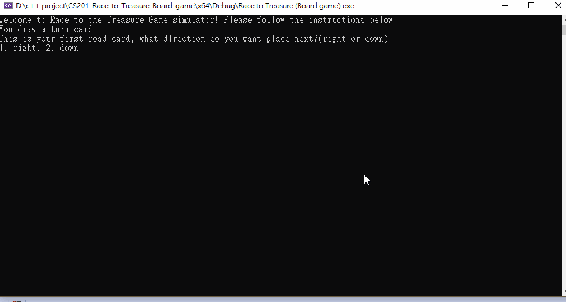

# CS201-Race-to-Treasure-Self-Developed-Board-game-

This program simulate the board game "Race To The Treasure"

Important note:
1. No 3 ways road cards in this program. Only straight forward cards and turn cards.
2. Increase the number of road cards to 30, straight forward cards 15 and turn cards 15.
3. If players have drew all the road cards and still not reach the end point, the game will end.
4. O<- represent a empty board position 
5. P<- represent the road have built
6. N<- represent the next road position
7. K<- represent keys
8. S<- represent snacks
9. The direction that the player is turning is base on the relative position of the previous road, NOT TRUE NORTH!!
example1: if the road is pointing "down" and player enter "1" for "turning right", the next road will be going "left" in the aspect of true north!!
example2: if the road is pointing "right" and player enter "2" for "turning left", the next road will be goint "up" in the aspect of true north!!

Known Bugs:
1. Players can overwrite the path thats already there.
2. If players purposely turn into a wall, the system will return error message but the direction system will mess up for the next input.

### App Walkthough GIF

GIF created with [LiceCap](http://www.cockos.com/licecap/).
